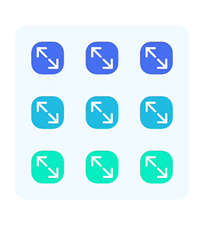
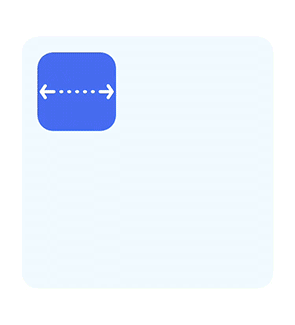

<p align="center">
    
</p>

**tl;dr** *Nothing but sugar.*

**Tiny Constraints** is some syntactic sugar that makes NSLayoutConstraint sweeter for human use.



## Features

- [X] Shortest possible syntax for creating layout constraints.
- [X] Constraints are active by default.
- [X] 100% compatible with Auto Layout.
- [X] Optionally store your constraints.
- [X] Set constraint priorities upon creation.

## Examples

Attaching a view to its superview with `NSLayoutConstraint`:
```swift
NSLayoutConstraint.activate([
    view.topAnchor.constraint(equalTo: superview.topAnchor, constant: 0),
    view.leadingAnchor.constraint(equalTo: superview.leadingAnchor, constant: 0),
    view.bottomAnchor.constraint(equalTo: superview.bottomAnchor, constant: 0),
    view.trailingAnchor.constraint(equalTo: superview.trailingAnchor, constant: 0)
])
```

with `Tiny Constraints`:
```swift
view.edges(to: superview)
```

or:
```swift
view.edges(to: superview, insets: UIEdgeInsets(top: 10, left: 10, bottom: 0, right: 0))
```

Constraining the center of a view to its superview with `NSLayoutConstraint`:
```swift
NSLayoutConstraint.activate([
	view.centerXAnchor.constraint(equalTo: superview.centerXAnchor, constant: 0)
	view.centerYAnchor.constraint(equalTo: superview.centerYAnchor, constant: 0)
])
```

with `Tiny Constraints`:
```swift
view.center(in: superview)
```

or:
```swift
view.center(in: superview, offset: CGPoint(x: 10, y: 10))
```

## Basic Use
### Typealiases

`Tiny Constraints` gives you convenient and tiny typealiases for handling constraints.

- Constraint = NSLayoutConstraint
- Constraints = [NSLayoutConstraint]

### Equal and Unequal Anchors
This constraints the `top-anchor` of the view to the `top-anchor` of the superview.
```swift
view.top(to: superview)
```

This constraints the `top-anchor` of the view to the `bottom-anchor` of the superview.
```swift
view.top(to: superview, superview.bottomAnchor)
```

### Storing Constraints
Here we create a set of inactive constraints and store these to our property.
```swift
let constraints = view.size(CGSize(width: 100, height: 100), isActive: false)
```

### Activation and Deactivation
Besides the default `NSLayoutConstraint` activation, `Tiny Constraints` also provides a way to activate *a set* of constraints.
```swift
constraints.activate()
```

You can also do this in an animation:
```swift
oldConstraints.deActivate()

constraints.activate()
UIViewPropertyAnimator(duration: 1, dampingRatio: 0.4) {
    self.layoutIfNeeded()
    }.startAnimation()
```

### Animating Constraint Constants
Here we add a height constraint to a view, store it and animate it later.
```swift
let height = view.height(100)

height.constant = 200
UIViewPropertyAnimator(duration: 1, dampingRatio: 0.4) {
    self.layoutIfNeeded()
    }.startAnimation()
```

Find these examples and more in the `Example Project`.

## Installation

TinyConstraints is available through [CocoaPods](http://cocoapods.org). To install
it, simply add the following line to your Podfile:

```ruby
pod "TinyConstraints"
```

## Suggestions or feedback?

Feel free to create a pull request, open an issue or find me [on Twitter](https://twitter.com/roberthein).
